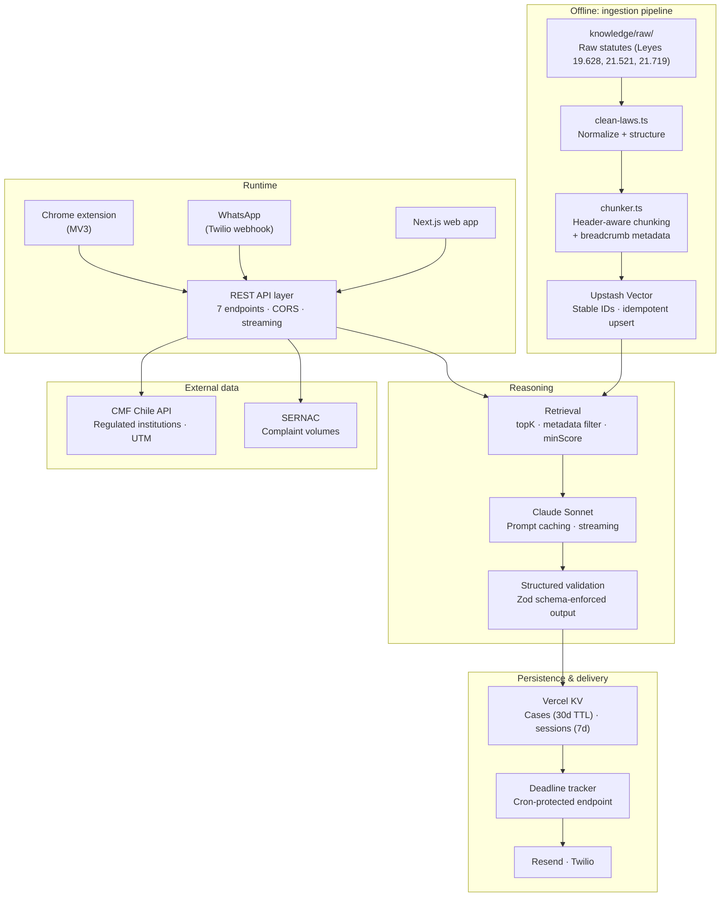

# Defiende Tus Datos — AI Legal Assistant for Chilean Data Protection Claims

A production-shaped RAG application that guides non-expert users through filing a formal data protection claim under Chilean law, from problem intake to a legally grounded draft delivered by email or WhatsApp.

**Built for the Claude Impact Lab Hackathon — placed in the top 12 of 48 teams.**

Stack: Next.js 16 · TypeScript · Anthropic Claude API · Upstash Vector · Vercel KV · Twilio · Resend

---

## The problem

In 2024 Chile enacted **Ley 21.719**, a GDPR-style data protection law that grants individuals real rights over their personal data: access, rectification, deletion, and objection. In practice almost nobody exercises them. The law is a 150,000-character legal text, the applicable article depends on the specific facts of your case, the correct filing channel depends on the type of infraction, and every claim carries a statutory response deadline that most people never track.

The gap is not access to the law — it is public. The gap is **translating a lived problem into a correctly grounded legal claim**.

## What it does

The system runs a user through a five-phase interview and produces a filing-ready claim:

| Phase | What happens |
|---|---|
| **Intake** | User describes the problem in plain language |
| **Canal** | System determines the correct filing channel (company directly, regulatory agency, or court) |
| **Entrevista** | Guided questioning to extract the facts the law actually requires |
| **Revisando** | Structured legal evaluation against the retrieved statutes |
| **Entrega** | Draft claim delivered by email, with deadline tracking |

The output is a typed object, not prose: violated articles, infraction severity (`leve` / `grave` / `gravísima`), maximum applicable sanction, recommended channel, CMF verification status, and the claim draft itself.

## Architecture



---

## Engineering decisions worth explaining

### Custom chunking instead of fixed-window splitting

Legal text loses its meaning when split blindly. `lib/chunker.ts` implements three strategies:

- **Markdown** splits on `##` / `###` boundaries and attaches a **breadcrumb** to each chunk (`Derechos del Titular > Derecho de Rectificación (Art. 6°)`), so a retrieved fragment carries its own hierarchical position. H1 is deliberately ignored — it duplicates the frontmatter prefix already prepended before embedding.
- **CSV** groups rows in blocks of 25 with the header row repeated at the front, so every chunk preserves column context. This matters for registries like the CMF institution list.
- **Plain text** falls back to paragraph accumulation.

Bounds are 100–1500 characters, with oversized blocks recursively sub-split by paragraph.

### Idempotent ingestion

Chunk IDs are deterministic (`<filename>::<chunkIndex>`), so re-running ingestion overwrites in place rather than duplicating. The pipeline supports `--dry-run` to inspect generated chunks without writing, `--source` to re-ingest a single file, and `--clear` to rebuild the index from scratch. Document `type` is inferred from frontmatter when present, falling back to filename pattern matching.

```bash
npm run ingest                          # full re-ingest
npm run ingest -- --source 21719.md     # single document
npm run ingest -- --dry-run             # inspect without writing
```

### Retrieval is filtered, not just ranked

Different phases need different corpora. The validator queries statutes; the interviewer queries precedent cases. `lib/rag.ts` exposes typed retrieval options — `topK`, a `minScore` relevance floor (default 0.5), and metadata filters compiled to Upstash filter expressions (`type = 'ley' OR type = 'casos'`).

### Query construction is phase-aware

Naively embedding the last user message works for conversational turns but fails for evaluation, where the case is distributed across the whole transcript. `lib/rag-query.ts` provides three strategies: last user message, last N user turns, and a full-transcript query prefixed with an intent hint (*identify violated articles, rights, deadlines, channel, sanctions*).

### Schema-enforced generation

The claim evaluation is not parsed out of free text. `app/api/validate-claim/route.ts` uses Zod with the Anthropic SDK's `zodOutputFormat` helper, so the model emits an object conforming to the `ClaimReview` schema or the request fails loudly. Downstream persistence and delivery can then assume shape.

### Prompt caching

Retrieved statutory context and static system instructions are sent as separate system blocks marked `cache_control: { type: "ephemeral" }`. The legal corpus is large and stable across turns within a session; caching it cuts both cost and time-to-first-token materially.

### Graceful degradation on external APIs

The CMF and SERNAC lookups run in parallel via `Promise.all`, each with a 5-second `AbortSignal.timeout` and a module-level cache. If either is unavailable the system falls back to a curated static dataset and continues — a regulator's API being down should not take down a legal assistant. CMF verification is additionally never downgraded: a company known to be regulated stays regulated even when its legal name doesn't string-match its brand name.

### Three surfaces, one API

The same backend serves a Next.js web app, a Twilio WhatsApp webhook with server-side session state, and a Manifest V3 Chrome extension. Conversation phase and message history live in Vercel KV keyed by phone number, so a WhatsApp user resumes where they left off.

---

## Evaluation

`scripts/smoke-test.ts` runs a full end-to-end scenario against the live endpoints — a canonical DICOM case (debt paid, record not cleared) walked through every phase — and asserts that both the conversational agent and the structured validator return coherent, schema-valid results.

`scripts/probe.ts` is a retrieval debugging harness for inspecting what a given query actually pulls back, with scores and metadata.

```bash
npm run dev      # terminal 1
npm run smoke    # terminal 2
npm run probe    # inspect retrieval for an arbitrary query
```

---

## Tech stack

| Layer | Choice |
|---|---|
| Framework | Next.js 16 (App Router), React 19, TypeScript 5.7 |
| LLM | Claude Sonnet via `@anthropic-ai/sdk` — streaming, prompt caching, structured outputs |
| Vector store | Upstash Vector (managed embeddings, `mxbai-embed-large-v1`, multilingual) |
| State | Vercel KV — cases at 30d TTL, WhatsApp sessions at 7d |
| Validation | Zod v4 |
| Delivery | Resend (email), Twilio (WhatsApp) |
| External data | CMF Chile API, SERNAC complaint statistics |
| UI | Tailwind 4, Radix primitives |
| Deployment | Vercel |

## Project structure

```
app/api/          7 REST endpoints (chat-legal, validate-claim, rut-scan,
                  cmf-lookup, send-claim, tracker, whatsapp)
lib/              rag.ts · chunker.ts · rag-query.ts · knowledge.ts
                  cmf-api.ts · sernac.ts · kv.ts · resend.ts · whatsapp.ts
scripts/          ingest.ts · clean-laws.ts · smoke-test.ts · probe.ts
knowledge/        Cleaned statutory corpus + typical case patterns
knowledge/raw/    Source legal texts before normalization
extension-datos/  Chrome extension (Manifest V3)
```

## Running locally

```bash
npm install
cp .env.local.example .env.local   # fill in credentials
npm run ingest                     # populate the vector index
npm run dev
```

Required: `ANTHROPIC_API_KEY`, `UPSTASH_VECTOR_REST_URL`, `UPSTASH_VECTOR_REST_TOKEN`.
Optional (features degrade gracefully without them): `RESEND_API_KEY`, `TWILIO_*`, `KV_*`, `CMF_API_KEY`.

Create the Upstash index in **data mode** with a multilingual embedding model — the corpus is Spanish legal text.

---

## Honest limitations

This was built under hackathon time constraints. Documenting what is real and what is scaffolding matters more than the demo looking complete:

- **`/api/rut-scan` is a simulation.** It performs genuine RUT checksum validation and enriches results with live CMF and SERNAC data, but which companies "hold your data" is derived from a deterministic per-RUT hash bounded by published sector penetration rates. It is not a real data-broker lookup. Consistent across runs, illustrative, not factual.
- **Embeddings are managed by Upstash.** Deliberate trade-off: it removed an entire subsystem from the 48-hour scope, at the cost of control over the embedding model, dimensionality, and the ability to experiment with the vector space.
- **No formal eval set.** The smoke test verifies the pipeline runs coherently end to end; it does not measure retrieval precision or factual accuracy against a labeled ground truth. That is the first thing I would build next.
- **Not legal advice.** The system produces a grounded draft for a human to review and file.

## What I would build next

1. A labeled evaluation set of case → correct-article pairs, with retrieval precision@k and citation-faithfulness scoring as regression gates.
2. Self-hosted embeddings to enable hybrid lexical + semantic retrieval — legal queries hinge on exact article numbers, where pure dense retrieval is weakest.
3. Automated corpus refresh, since statutes and regulatory registries change.

---
